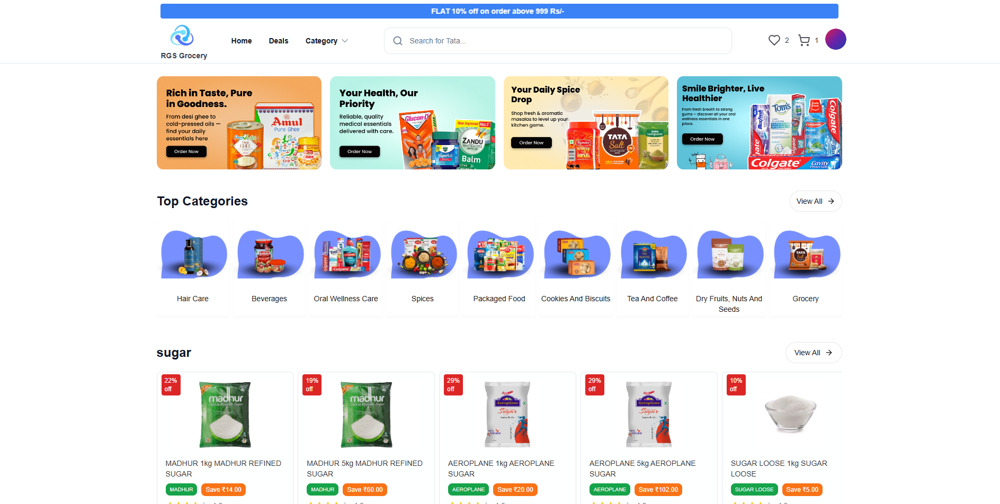

<p align="center">
  
</p>


# <p align="center">🛒 RGS Groceries</p>

Live at: 👉 [https://www.rgsgroceries.com/](https://www.rgsgroceries.com/)

RGS Groceries is a full-stack grocery shopping application that delivers a smooth, scalable experience across mobile and web platforms. It supports OTP-based login, real-time cart and checkout, and PDF invoice generation with a powerful admin panel for order, product, and store management.

---

## 🚀 Features

### 🌐 Frontend (Customer Panel)
- 🔐 OTP-based login with Appwrite
- 🛒 Add-to-cart, quantity selector, and checkout
- 🧾 **PDF Invoice is dynamically generated from the backend at checkout**
- 🧠 Zustand for global state management
- 🔍 Real-time filtering, search, and sorting
- 📦 Category-wise dropdown with thumbnails
- 💬 Toast notifications
- ⚡ Optimized with TailwindCSS + Vite

---

## 📸 Screenshots

### 🖥️ Website View



---

## 🧑‍💻 Tech Stack

### Frontend
- React
- Vite
- Tailwind CSS
- Zustand
- React Hook Form + Zod
- Appwrite
- Framer Motion
- Lucide Icons


## 📁 Folder Structure

### 📦 Frontend (`RGS-Grocery-Frontend/`)
### Feature Slice Design Architecture

```
src/
├── main.jsx                 # React entry point
├── index.css                # Global base styles

├── app/
│   ├── providers/
│   │   └── zustandStoreApi.js   # Central setup for Zustand store access
│   ├── styles/
│   │   └── app.css              # Global app-specific styles
│   ├── routes/
│   │   └── AppRouter.jsx        # All app-level routing setup

├── widgets/
│   ├── rating/
│   │   └── Rating.jsx
│   ├── skeletons/
│   │   ├── HomeSkeleton.jsx
│   │   └── CategorySkeleton.jsx
│   ├── AdCarousal.jsx
│   ├── AdsCard.jsx
│   ├── Card.jsx
│   ├── CategoryCard.jsx
│   ├── CTA.jsx
│   ├── Features.jsx
│   ├── FilterProducts.jsx
│   ├── Footer.jsx
│   ├── Heart.jsx
│   ├── Highlight.jsx
│   ├── Hint.jsx
│   ├── ImageSlider.jsx
│   ├── InvoiceTemplate.jsx
│   ├── Loading.jsx
│   ├── Logo.jsx
│   ├── Motion.jsx
│   ├── MaxWidthWrapper.jsx
│   ├── NavBar.jsx
│   ├── ProductSlider.jsx
│   ├── ProductDisplayCarousel.jsx
│   ├── Profile.jsx
│   ├── SearchInput.jsx
│   ├── Sheet.jsx
│   ├── ShowCategory.jsx
│   ├── UserAvatar.jsx

├── pages/
│   ├── account/
│   │   ├── Account.jsx
│   │   ├── Address.jsx
│   │   ├── OrderDetail.jsx
│   │   ├── Orders.jsx
│   │   └── ProfileContent.jsx
│   ├── auth/
│   │   └── Login.jsx
│   ├── About.jsx
│   ├── Category.jsx
│   ├── CategoriesTag.jsx
│   ├── Checkout.jsx
│   ├── Contact.jsx
│   ├── Deals.jsx
│   ├── Home.jsx
│   ├── NotFound.jsx
│   ├── OrderSuccessPlaced.jsx
│   ├── Product.jsx
│   ├── Search.jsx

├── features/
│   ├── auth/
│   │   ├── model/
│   │   │   └── auth.js
│   │   ├── services/
│   │   │   └── appwrite.js
│   │   └── ui/
│   │       ├── SignIn.jsx
│   │       └── SignUp.jsx
│   ├── cart/
│   │   ├── model/
│   │   │   ├── cartStorage.js
│   │   │   └── wishlistStorage.js
│   │   └── ui/
│   │       ├── AddToCart.jsx
│   │       ├── AddToWish.jsx
│   │       ├── CartItems.jsx
│   │       └── Cart.jsx

├── entities/
│   ├── category/
│   │   └── model/
│   │       └── categoryStore.js
│   ├── order/
│   │   └── model/
│   │       └── orderStore.js
│   ├── product/
│   │   └── model/
│   │       └── productStore.js
│   ├── user/
│   │   └── model/
│   │       └── userStore.js
```

**Root files:**
- `.env`, `.gitignore`, `.prettierrc`, `tailwind.config.js`, `vite.config.js`, `vercel.json`, `index.html`, `eslint.config.js`

---


## ⚙️ Setup & Installation

### Frontend

```bash
git clone https://github.com/your-repo/RGS-Grocery-Frontend.git
cd RGS-Grocery-Frontend
npm install
npm run dev
```

---


## .env.sample

```bash
# === Backend URLs ===
REACT_APP_PRODUCTION_BACKEND_URL=https://your-production-backend-url.com
REACT_APP_LOCAL_BACKEND_URL=http://localhost:3001

# === Environment Mode ===
REACT_APP_NODE_ENV=production

# === Appwrite Configuration ===
VITE_APP_APPWRITE_ENDPOINT=https://cloud.appwrite.io/v1
VITE_APP_APPWRITE_PROJECT_ID=your_appwrite_project_id
```
---

## 🤝 Contribution

Pull requests are welcome! For major changes, please open an issue first to discuss what you would like to change.

---

## 📬 Contact

📧 Email: **sumittsinghr369@gmail.com**  
🔗 LinkedIn: [Sumit Singh Raghuwanshi](
https://www.linkedin.com/in/sumit-singh-raghuwanshi/)

---

## 🛡 License

This project is licensed under the [ISC License](https://opensource.org/licenses/ISC)